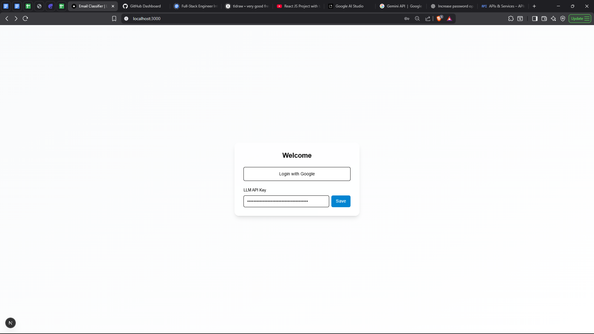
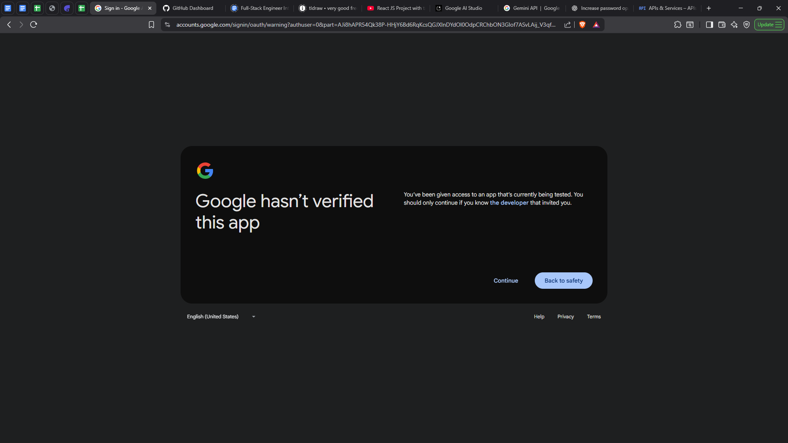
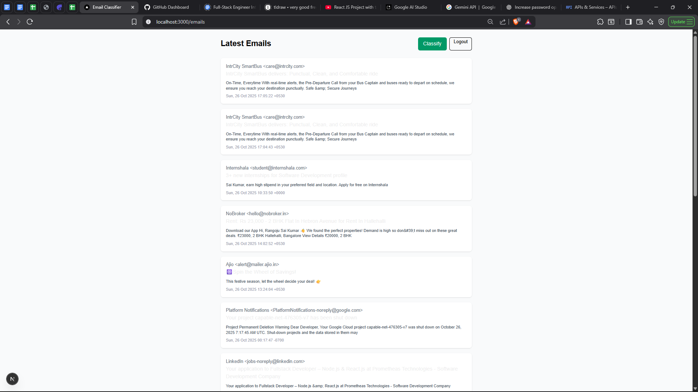
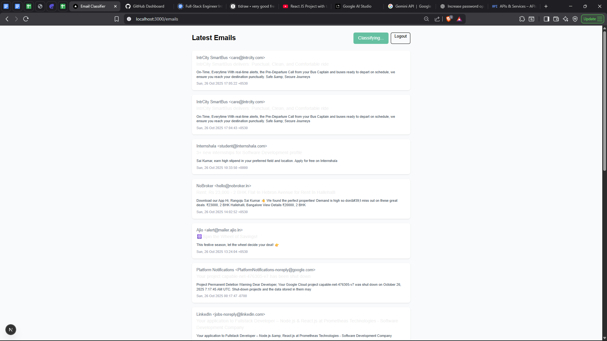
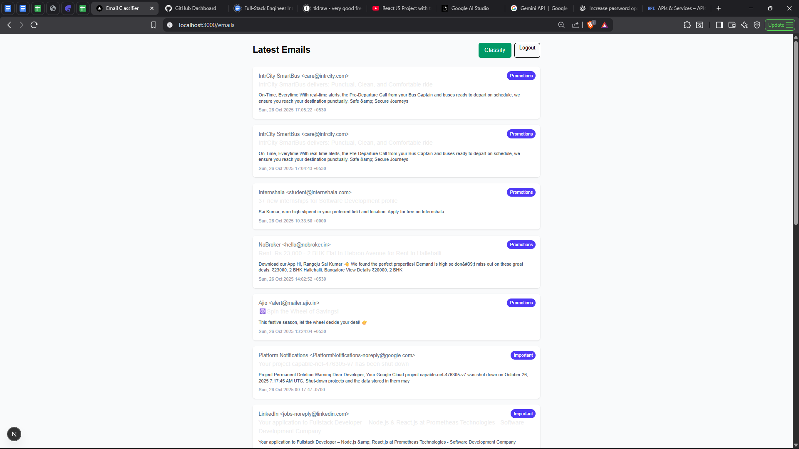

# 📧 Email Classifier — Next.js + Express + Gemini AI

An AI-powered email dashboard that lets users **log in with Google**, **fetch Gmail messages**, and **classify them intelligently** using **Google Gemini** or a **local fallback classifier**.

Built with:

* **Next.js (App Router)** — Frontend UI & routing
* **Tailwind CSS** — Styling
* **Express.js** — Backend API & authentication
* **Google OAuth 2.0** — Secure login
* **Gmail API** — Fetch recent emails
* **Gemini SDK (`@google/genai`)** — Classify emails with AI

---

## 🚀 Features

✅ Google Login via OAuth2
✅ Fetch latest Gmail messages
✅ User-provided Gemini API key for classification
✅ AI-based classification into categories:

* Important
* Promotions
* Social
* Marketing
* Spam
* General

✅ Local fallback classifier (keyword-based) if no API key or network fails
✅ Clean Tailwind UI with badges per email
✅ Session-based authentication
✅ Modular code (frontend + backend separated)

---

## 🧩 Tech Stack

| Layer        | Tech Used                                 |
| ------------ | ----------------------------------------- |
| **Frontend** | Next.js (App Router), React, Tailwind CSS |
| **Backend**  | Express.js, Node.js, Google APIs          |
| **Auth**     | Google OAuth 2.0                          |
| **AI**       | Gemini (via `@google/genai`)              |
| **Session**  | express-session (MemoryStore in dev)      |

---

## 🗂️ Project Structure

```
📦 email-classifier
├── frontend             # Next.js app pages
│   ├── page.tsx        # Login / Landing
│   └── emails/page.tsx # Inbox / Classification page
├── backend/            # Express backend
│   ├── routes/
│   │   ├── auth.js     # Google OAuth2 login
│   │   ├── gmail.js    # Gmail API routes
│   │   └── classify.js # Gemini + fallback classifier
│   ├── server.js       # Express server setup
│   └── package.json
└── README.md
```
---

## ⚙️ Setup Instructions

### 🖥️ Prerequisites

* Node.js v18 or newer
* A Google Cloud Project with:

  * **OAuth 2.0 Client ID** (Web application)
  * **Gmail API enabled**
* A **Gemini API key** from [Google AI Studio](https://makersuite.google.com/)
* (Optional) Git + GitHub account for version control

---

### 1️⃣ Clone or initialize

```bash
git clone https://github.com/<your-username>/<repo-name>.git
cd <repo-name>
```

---

### 2️⃣ Install dependencies

**Frontend:**

```bash
npm install
```

**Backend:**

```bash
cd backend
npm install
```

---

### 3️⃣ Environment variables

Create a `.env` file inside `backend/`:

```bash
# backend/.env
PORT=5000
BACKEND_URL=http://localhost:5000
FRONTEND_URL=http://localhost:3000
SESSION_SECRET=some-random-secret

# Google OAuth
GOOGLE_CLIENT_ID=your-google-client-id.apps.googleusercontent.com
GOOGLE_CLIENT_SECRET=your-google-client-secret

# Optional Gemini model settings
GEMINI_MODEL=gemini-2.5-flash
# GEMINI_API_URL=https://generativeai.googleapis.com/v1/models/gemini-2.5-flash:generateContent
```

> ⚠️ **Never commit your `.env` file** to GitHub!
> It’s already ignored by `.gitignore`.

---

### 4️⃣ Run locally

Start the backend:

```bash
cd backend
npm run dev
```

Start the frontend (in another terminal):

```bash
npm run dev
```

Now open 👉 **[http://localhost:3000](http://localhost:3000)**

---

## 🧭 How It Works

1. **Login with Google**
   → Auth handled by backend (`/auth/google`), OAuth flow completed, session created.

2. **Fetch Emails**
   → Backend hits Gmail API and returns latest 15 emails.

3. **Classify Emails**

   * User enters Gemini API key on login page (stored in `localStorage`).
   * Frontend sends `/api/classify` request with emails + key.
   * Backend uses Gemini SDK:

     ```js
     import { GoogleGenAI } from "@google/genai";
     const ai = new GoogleGenAI({ apiKey });
     const res = await ai.models.generateContent({
       model: "gemini-2.5-flash",
       contents: prompt,
       generationConfig: { responseMimeType: "application/json" },
     });
     ```
   * Gemini returns strict JSON.
   * Backend parses → sends categories → frontend displays them as badges.

4. **Fallback**
   If no key or Gemini fails → keyword-based classification runs locally.

---

## 🧠 Classification Categories

| Category       | Description                              |
| -------------- | ---------------------------------------- |
| **Important**  | Work or personal mails needing attention |
| **Promotions** | Sales, offers, coupons                   |
| **Social**     | Friends, family, social media            |
| **Marketing**  | Newsletters, campaigns                   |
| **Spam**       | Unwanted or suspicious                   |
| **General**    | Default if no match                      |

---

## 📁 backend/.gitignore

```
node_modules/
.env
npm-debug.log*
yarn-error.log*
logs
*.log
.DS_Store
```


Built with  using:

* [Next.js](https://nextjs.org/)
* [Express](https://expressjs.com/)
* [Google APIs](https://developers.google.com/)
* [Gemini API](https://aistudio.google.com)
* [Tailwind CSS](https://tailwindcss.com)

---

## APP SCREENSHOTS







